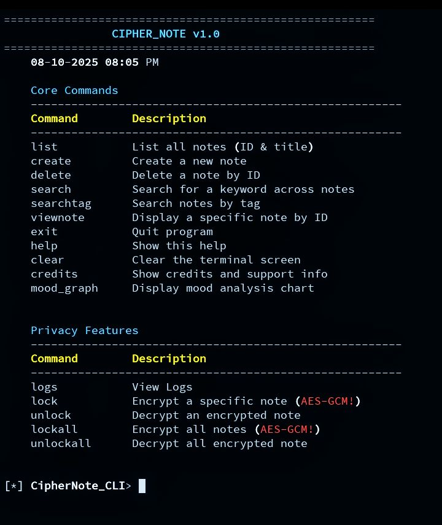
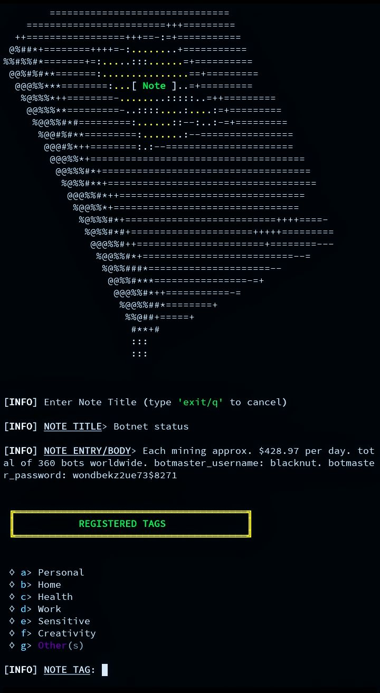
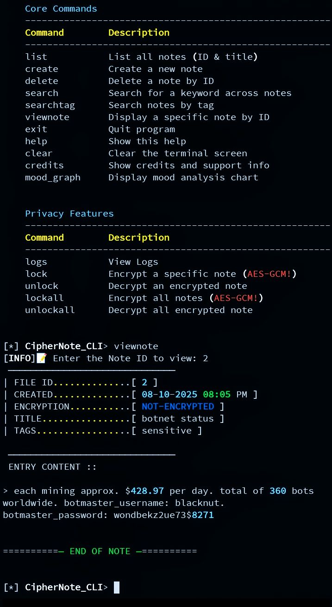
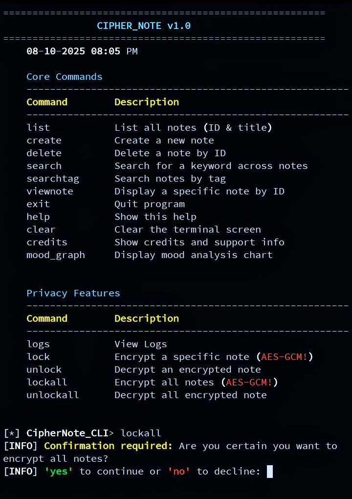
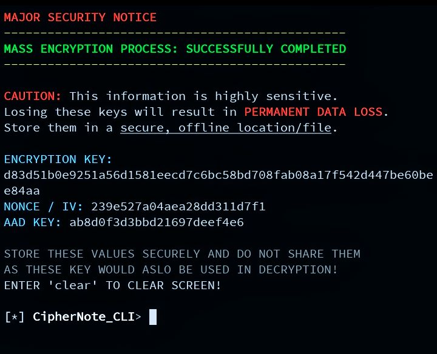

# 🔐 Cipher_Note

> “A private notebook cli for your thoughts — encrypted & organized”


-grey.svg)

---

## 🧭 Overview

**Cipher_Note** is a terminal-based notebook with encryption and mood logger built-in python features.  
It blends simplicity with security — Uses by `AES-GCM` encryption, `SQLite3` persistence, and colorful terminal feedback using `Rich`.

Think of it as your **personal journal CLI vault** — write notes, reflect, and store them safely, with option to apply modern cryptography encryption on all note(s) if you get burned.

---

## ⚙️ Features

- 🔒 **AES-GCM encryption**  
- 🧠 **Notebook + mood graph, log system**  
- 💬 **Polished CLI interface** (Rich formatted)  
- 🗂️ **SQLite database backend**  
- 🎲 Optional **Fortune-style quotes** for inspiration  
- ⚙️ platform support (Linux)

---






## 🧩 Project Structure
```bash
Cipher_Note/
    │
    ├── notebook.py                      # Entry point for CLI
    │
    ├── package/
    │       ├── core.py
    │       │  
    │       ├── encryption_admin.py  # Encryption manager (AES-GCM)
    │       │   
    │       └── __init__.py
    │       
    ├── images/       
    │      └── *.jpg
    │
    ├── data/
    │      └── notebook.db            # Sqlite3 database
    │
    └── logs/
           └── *.json                 # output log files


## Usage/Examples

```bash
cd Ciphernote-CLI/

python ciphernote-CLI.py

```

## Roadmap

- Additional UI support

- Add Windows integrations

- Program refactoring


## 🚀 About Me
This project was developed by a young programmer driven by curiosity and persistence.
My dedication to coding and passion for development led to the creation of this project.
---

## Authors

- u112000
